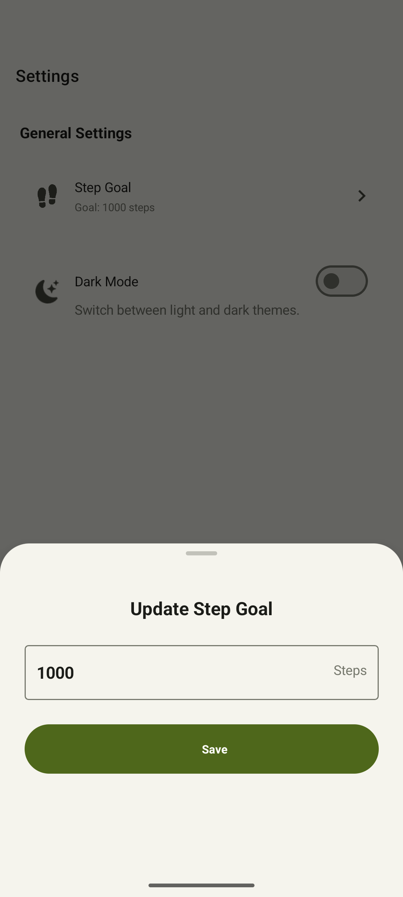

# Kuyenda - A .NET MAUI Pedometer App

> "Kuyenda" is a Nyanja word that means "walk" - the perfect name for a pedometer app!

## 📱 About

Kuyenda is a modern, cross-platform pedometer application built for the MAUI UI July 2025 challenge. It tracks your steps throughout the day, calculates distance and calories burned, and provides a clean, intuitive interface to monitor your daily activity.

## ✨ Features

- **Step Tracking**: Accurately counts your steps as you move
- **Calorie Calculation**: Estimates calories burned based on step count
- **Distance Measurement**: Converts steps to distance traveled
- **Step Goals**: Set personalized daily step targets
- **Dark Mode**: Toggle between light and dark themes
- **Data Persistence**: Your step data is stored locally, even when the app is closed
- **Responsive Design**: Works on various device sizes and orientations

## 🖼️ Screenshots

<table>
  <tr>
    <td></td>
    <td></td>
    <td></td>
    <td></td>
    <td></td>
    <td></td>
  </tr>
</table>

## 🔧 Technologies Used

- **.NET MAUI**: Cross-platform UI framework
- **CommunityToolkit.Mvvm**: MVVM architecture implementation
- **DevExpress MAUI Controls**: Premium UI components
- **Plugin.Maui.Pedometer**: Pedometer functionality
- **SQLite-net-pcl**: Local database for data persistence
- **.NET 9**: Latest language and framework features

## 📋 Requirements

- **Android**: Android 5.0 (API 21) or higher
- **iOS**: iOS 14.2 or higher
- **Development**: Visual Studio 2025 with .NET MAUI workload

## ⚙️ Installation

### From Source
1. Clone the repository:
   ```bash
   git clone https://github.com/davidnsai/Kuyenda.git
   ```
2. Open the solution in Visual Studio
3. Restore NuGet packages
4. Build and run the application

### Release
Download the latest release from the [Releases](https://github.com/davidnsai/Kuyenda/releases) page.

## 🚶‍♂️ Usage

1. **Starting the App**: Open Kuyenda to automatically begin tracking steps
2. **Setting Goals**: Navigate to Settings to customize your daily step goal
3. **Viewing Progress**: The main screen displays your current progress, including:
   - Current step count
   - Percentage of daily goal achieved
   - Estimated distance walked
   - Calories burned
4. **Changing Theme**: Toggle between light and dark mode in Settings

## ⚠️ Limitations

- **Background Tracking**: The step counter currently only tracks steps while the app is open. When closed, the app stops counting, but your data persists in the SQLite database.
- **Accuracy**: Step counting accuracy may vary based on device sensors and how the device is carried.
- **Battery Usage**: Continuous step tracking may impact battery life.

## 🧪 Testing

This application has been thoroughly tested on Android devices. iOS testing has been limited, but the app should function correctly on iOS devices with proper permissions granted.

## 🔜 Future Improvements

- Background step tracking when the app is closed
- Step history and statistics over time
- User profiles with height and weight for more accurate calculations


## 📄 License

This project is licensed under the MIT License - see the [LICENSE](LICENSE.txt) file for details.

## 📝 Credits

- DevExpress for their excellent MAUI controls
- Plugin.Maui.Pedometer for step counting functionality
- The .NET MAUI team for the framework
- All contributors to this project

---

*Built with ❤️ for MAUI UI July 2025*